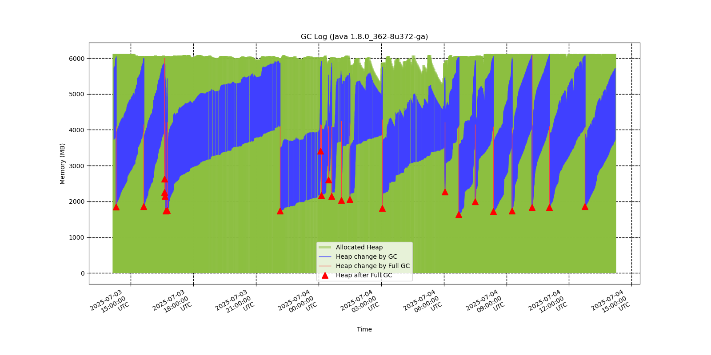

`java-gclog-graph` is a script to generate graph from Java garbage collector log.

# Features

 - Generate PNG image from Java garbage collection log
 - Parallel garbage collector - default for Java 1.8 - is supported
 - G1 garbage collector - default for Java 11, Java 17, Java 21 - is supported

# Installation

## Standard Environment

 - Copy the `java-gclog-graph.py` or clone the repository to destination directory
 - Install required packages - usually it is only `matplotlib` package to install

## Python Virtual Environment

```
git clone https://github.com/pes-soft/java-gclog-graph
virtualenv java-gclog-graph/venv
java-gclog-graph/venv/bin/pip install matplotlib
```

# Usage

`./java-gclog-graph.py --help`

This will show the help and supported switches:

```
usage: java-gclog-graph.py [-h] [-f LOGFILE] [-o OUTPUT] [-d DATETIME_FORMAT] [-t TAIL_TIME] [-m {change,after,before}] [-V]
```

 - **-f, --logfile LOGFILE** : Path to the input GC log file
 - **-o, --output OUTPUT** : Path to the output PNG file (default is ./java-gclog-graph.png)
 - **-d, --datetime-format DATETIME_FORMAT** : Format of timestamp in GC log (default is ISO 8601: %Y-%m-%dT%H:%M:%S.%f%z)
 - **-t, --tail-time TAIL_TIME** : Graph only the last seconds before the last data entry (supports suffix m,h,d,w; default is to graph all)
 - **-m, --heap-mode {change,after,before}** : Graph heap change either before GC, or after GC, or as a line with heap change (default is line with change)
 - **-V, --version** : Print current version and exit

# Examples

Parse log in `/app/javaapp/logs/gc-2025-06-08_17-07-28.log`, save output to `/app/javaapp/reports/gclog-CURRENT_DAY.png`, graph only entries from the 2 last days since the last event in the log:

`./java-gclog-graph.py -f /app/javaapp/logs/gc-2025-06-08_17-07-28.log -o /app/javaapp/reports/gclog-$(date +%a).png -t 2d`

Parse logs that have been modified earlier than 2 days ago in directory `/app/javaapp/logs` matching with file name regexp  `gc-*.log`, sorted by date of last modification and graph only entries from the 1 last day since the last event in the log:

`./java-gclog-graph.py -f <(find /app/javaapp/logs -mtime -2 -name 'gc-*.log' | xargs -d "\n" ls -tr | xargs -d "\n" cat) -o /app/javaapp/reports/gclog-$(date +%a).png -t 1d`

# Graph Samples

Java 1.8 Parallel garbage collector log processed, with limit on the recent 1 day, in default "change" heap mode.

